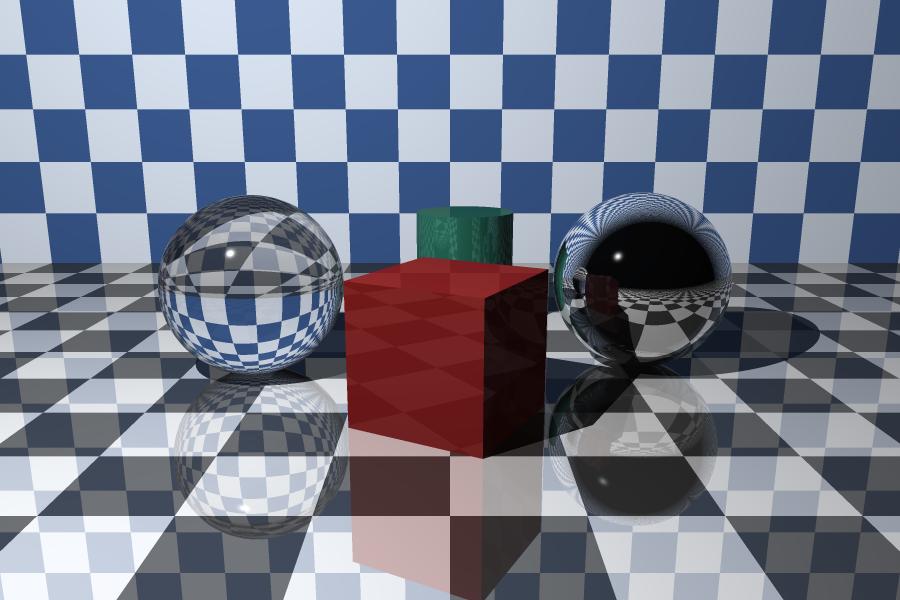

# The Ray Tracer Challenge — Kotlin

A Kotlin implementation of [*The Ray Tracer Challenge*](https://pragprog.com/titles/jbtracer/the-ray-tracer-challenge)
by Jamis Buck. The whole book is implemented — spheres, planes, cubes, cylinders, cones, triangles and
smooth triangles, groups, constructive solid geometry, an OBJ mesh parser, patterns, reflection,
refraction with Fresnel, and shadows — and every chapter's Gherkin spec is checked in as a Cucumber
`.feature` file.

*The whole renderer in one frame: a glass sphere (refraction + Fresnel), a chrome sphere (reflection),
a matte cube and a closed cylinder on a reflective checkered floor. Rendered at 900×600 with 3×3
supersampling — `./gradlew render -Pchapter=StillLife`.*

## Building and testing

Requires a JDK 25 toolchain. Common tasks (Gradle, or the [`just`](https://github.com/casey/just) equivalent):

| Task | Gradle | just |
| --- | --- | --- |
| Unit tests (kotest) | `./gradlew test` | `just test` |
| Acceptance tests (Cucumber) | `./gradlew cucumber` | `just cucumber` |
| Static analysis (detekt) | `./gradlew detekt` | `just lint` |
| Full quality gate | `./gradlew pre_commit` | `just check` |
| Render an example to PNG | `./gradlew render -Pchapter=StillLife` | `just render StillLife` |

Rendered PNGs land in the gitignored `/generated/` directory. Each chapter and showcase scene has a
runnable example under `examples/` (e.g. `Chapter15Teapot`, `CoverImage`, `CsgDie`, `StillLife`);
`render` defaults to `All`.

## Development notes

A large part of this codebase was written with [Claude Code](https://claude.com/claude-code),
Anthropic's agentic CLI, pair-programming under my direction — in particular the later chapters
(reflection, refraction, cubes, cylinders, cones, groups, CSG, the OBJ parser and smooth triangles),
all of the example scenes under `examples/`, and the supersampling anti-aliasing. Commits authored
together carry a `Co-Authored-By: Claude` trailer.

## The book

- [Book homepage](https://pragprog.com/titles/jbtracer/the-ray-tracer-challenge)
- [Book at devtalk](https://devtalk.com/books/the-ray-tracer-challenge)
- https://learning.oreilly.com/library/view/the-ray-tracer/9781680506778/
- http://www.raytracerchallenge.com/
- [Forum](https://forum.raytracerchallenge.com/)

## Tools used

- [Gradle](https://gradle.org/)
- [Kotlin](https://kotlinlang.org/)
- [kotest](https://kotest.io/)
- [Cucumber](https://cucumber.io/) / [Cucumber JVM](https://github.com/cucumber/cucumber-jvm)
- [detekt](https://detekt.dev/)

## Web pages used

- [Setting up Cucumber with Gradle and Kotlin](https://github.com/eaneto/gradle-kotlin-dsl-cucumber-configuration/blob/master/build.gradle.kts)
- [Getting into Cucumber and Kotlin](https://cucumber.io/docs/guides/10-minute-tutorial/#write-a-scenario)
